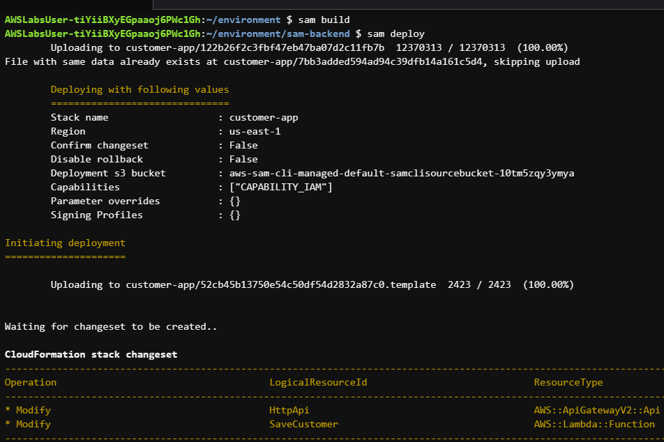

# Python Challenge
Architecture
## Overview
  In this lab, you get hands-on experience testing your Python skills by updating application code for AWS Lambda functions that read and write directly from and to an Amazon DynamoDB table. The table data is added and retrieved through an Amazon Simple Storage Service (Amazon S3) hosted website that has an Amazon API Gateway integration to access the Lambda functions. The Lambda functions perform two of the four create, read, update, delete (CRUD) operations.
  The website contains a button that puts items into the DynamoDB table and lists the current customers in the LabCustomers table. The Lambda function and code is already supplied for this feature. The website also features a form where you can enter new customer details, including the customer ID, firstname, and lastname. This form is connected to the SaveCustomer Lambda function, which currently doesn’t perform any actions.
## Tasks
* You are challenged to update the Lambda function to retrieve the ID, Firstname, and Lastname from the Lambda event that’s based on   the submitted form from the Amazon S3-hosted website.
* Next, you write the put_item code to save the item into the LabCustomers table. After you write the code, the last step is to use    the AWS Serverless Application Model (AWS SAM) to deploy the updated code for the application.
## Objectives
* Understand the AWS SDK for Python (Boto3) client code for DynamoDB in the application files.
* Update a Python application to PUT customer details into a DynamoDB table.
* Use Python code to update a DynamoDB table with parameters that are retrieved from an API Gateway request.

Resources:
* Amazon S3 hosted website
**Application files**
* html-frontend/index.html - This HTML document is primarily used for interacting with an API endpoint to save and list customer data to and from a DynamoDB table that’s named LabCustomers.
* sam-backend/ListCustomers/app.py
This Python script uses the SDK for Python to interact with the DynamoDB table that’s named LabCustomers. In short, this script retrieves all items from the LabCustomers table in DynamoDB and returns them in a specific format.
```python
import boto3

dynamodb = boto3.client("dynamodb")


def lambda_handler(event, context):
    query_response = dynamodb.scan(TableName="LabCustomers")

    lists = [ [item["ID"]["S"], item["Firstname"]["S"], item["Lastname"]["S"]] for item in query_response["Items"]]

    return { "result": lists } 
```
Challenge to update sam-backend/SaveCustomers/app.py
```python
import boto3

dynamodb = boto3.client("dynamodb")


def lambda_handler(event, context):
    print(event)
    id = event["queryStringParameters"]["id"]
    firstname = event["queryStringParameters"]["firstname"]
    lastname = event["queryStringParameters"]["lastname"]

    ####
    # Challenge: put the customer id, firstname, last name into the dynamo db table
    ####

    # Your code goes here

    return {"result": "Saved"}
```
### Solution
Solution steps:
* Following the # Challenge: put the customer id, firstname, last name into the dynamo db table comment, enter the following code:put_response = dynamodb.put_item(
* On the next line, enter TableName="LabCustomers",.This line specifies the name of the DynamoDB table where the item is   
  inserted.
* On the next line, enter Item={.This line starts to define the dictionary that contains the data to be inserted into the table.
* On the next three lines, enter the following:
  "ID" : {"S" : id},
  'Firstname': {'S': firstname},
  'Lastname': {'S': lastname},
  These lines add the customer id, firstname, and lastname to the Item dictionary.
* On the following line, close the put_item function and the Item dictionary by entering }).
* Finally, to ensure that your code matches the solution and functions as expected, check your code against the solution file,   
  which is named sam-backend/SaveCustomer/app_solution.py.

```python
import boto3

dynamodb = boto3.client("dynamodb")


def lambda_handler(event, context):
    print(event)
    id = event["queryStringParameters"]["id"]
    firstname = event["queryStringParameters"]["firstname"]
    lastname = event["queryStringParameters"]["lastname"]

    #####
    # Solution...
    #####
    put_response = dynamodb.put_item(
        TableName="LabCustomers",
        Item={
            "ID": {"S": id},
            "Firstname": {"S": firstname},
            "Lastname": {"S": lastname},
        },
    )

    return {"result": "Saved"}
```
**Task complete:** You have updated the sam-backend/SaveCustomer/app.py file with the missing code snippet. The code snippet updates the LabCustomers DynamoDB table with the new customer parameters that are retrieved from the web form by using API Gateway.
### Deploy the updates and test
In this task, you use AWS SAM to build and deploy the updated application package. After you deploy the updated application package, you then test the application. To test it, you return to the Amazon S3-hosted website and update the fields for the customer ID, First Name, and Last Name.
* Command: To change to the ~/environment directory, and to use the AWS SAM CLI to build the deployment files and redeploy the application with the latest code updates, run the following grouped set of commands:
```
cd ~/environment/sam-backend; sam build; sam deploy
```



* After the application updates, switch back to the browser tab that’s opened to the Amazon S3 hosted website.

* Update the following fields with new details of your own, or by using the following values:

* For Customer ID:, enter AB12
* For First Name:, enter Challenge
* For Last Name:, enter Completed
* Choose the Put Item button.
* Below the Put Item button, the table should automatically update with the customer details that you just submitted.
  

  
**Task complete:** You have successfully deployed the latest application updates. You also tested the application to confirm that it stores new customer details in the DynamoDB table, and that it retrieves the table items to display in the Amazon S3 hosted website.
