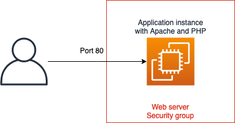
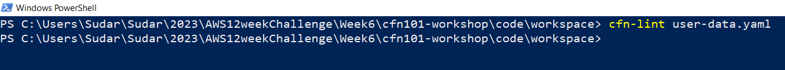
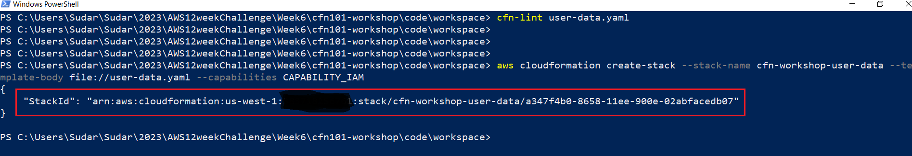
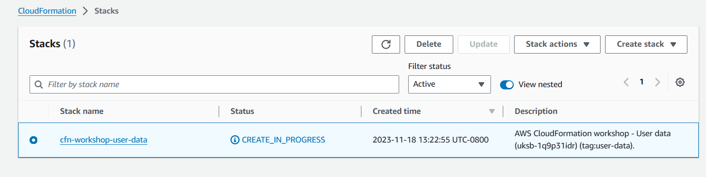
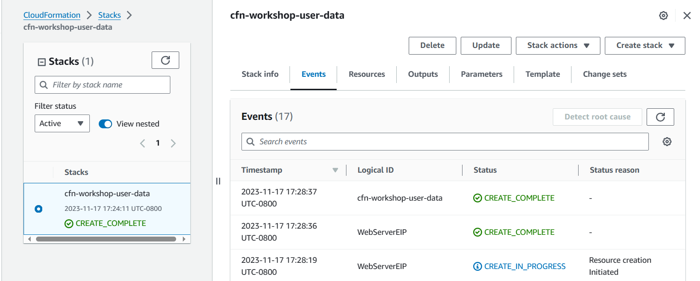
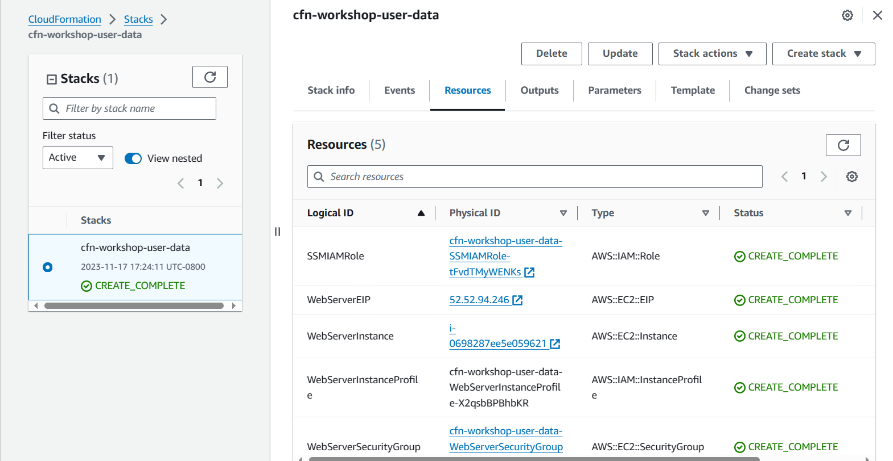
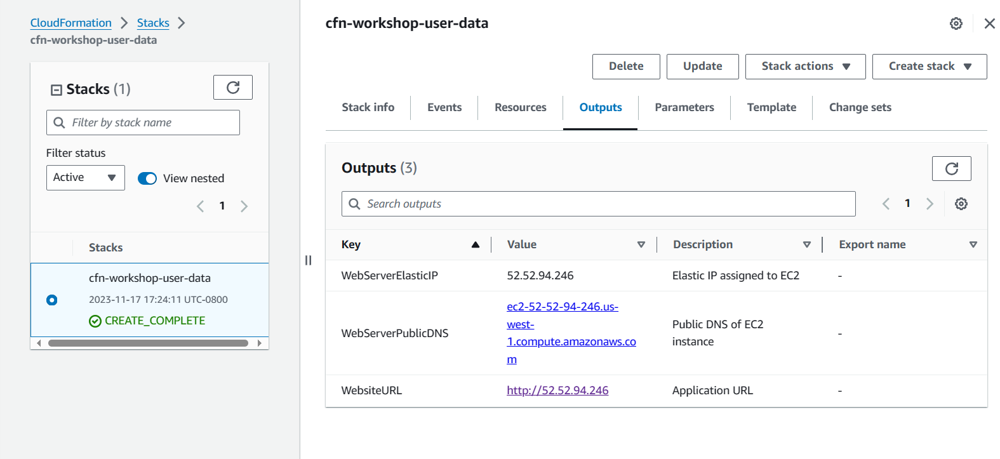

# User Data Lab
## Overview
You can use AWS CloudFormation to automatically install, configure, and start applications on Amazon EC2 instances. Doing so enables you to easily replicate deployments and update existing installations without connecting directly to the instance, which can save you a lot of time and effort.

In this lab, you will deploy an Apache Web server with a simple PHP application via the UserData  property.
### High-level Architecture



### Steps
* First, you will bootstrap the EC2 instance to install a web server and content.
* Then you will create an EC2 Security Group and allow access on port 80 to the instance.
* Finally, you will view the content served by the web server.
#### user-data.yaml file creation
1. Go to your working directory.
2. Create a file user-data.yaml.
3. Copy the below code and paste it.

user-data.yaml
```
AWSTemplateFormatVersion: "2010-09-09"

Description: AWS CloudFormation workshop - User data (uksb-1q9p31idr) (tag:user-data).

Metadata:
  AWS::CloudFormation::Interface:
    ParameterGroups:
      - Label:
          default: 'Amazon EC2 Configuration'
        Parameters:
          - AmiID
    ParameterLabels:
      AmiID:
        default: 'Amazon Machine Image ID'

Parameters:
  EnvironmentType:
    Description: 'Specify the Environment type of the stack.'
    Type: String
    Default: Test
    AllowedValues:
      - Dev
      - Test
      - Prod
    ConstraintDescription: 'Specify either Dev, Test or Prod.'

  AmiID:
    Type: AWS::SSM::Parameter::Value<AWS::EC2::Image::Id>
    Description: 'The ID of the AMI.'
    Default: /aws/service/ami-amazon-linux-latest/amzn2-ami-hvm-x86_64-gp2

Mappings:
  EnvironmentToInstanceType:
    Dev:
      InstanceType: t2.nano
    Test:
      InstanceType: t2.micro
    Prod:
      InstanceType: t2.small

Resources:
  SSMIAMRole:
    Type: AWS::IAM::Role
    Properties:
      AssumeRolePolicyDocument:
        Statement:
          - Effect: Allow
            Principal:
              Service:
                - ec2.amazonaws.com
            Action:
              - sts:AssumeRole
      ManagedPolicyArns:
        - arn:aws:iam::aws:policy/AmazonSSMManagedInstanceCore

  WebServerInstanceProfile:
    Type: AWS::IAM::InstanceProfile
    Properties:
      Path: /
      Roles:
        - !Ref SSMIAMRole
  WebServerInstance:
    Type: AWS::EC2::Instance
    Properties:
      IamInstanceProfile: !Ref WebServerInstanceProfile
      ImageId: !Ref AmiID
      InstanceType: !FindInMap [EnvironmentToInstanceType, !Ref EnvironmentType, InstanceType]

      # Associate the security group with EC2 instance with 'SecurityGroupIds' property.
      SecurityGroupIds:
        - !Ref WebServerSecurityGroup
      Tags:
        - Key: Name
          Value: !Join [ '-', [ !Ref EnvironmentType, webserver ] ]
      # Add the code from '2. Install Apache web server on the instance' step here.
      UserData: !Base64 |
        #!/bin/bash
        yum update -y
        yum install -y httpd php
        systemctl start httpd
        systemctl enable httpd
        usermod -a -G apache ec2-user
        chown -R ec2-user:apache /var/www
        chmod 2775 /var/www
        find /var/www -type d -exec chmod 2775 {} \;
        find /var/www -type f -exec chmod 0664 {} \;
        # PHP script to display Instance ID and Availability Zone
        cat << 'EOF' > /var/www/html/index.php
          <!DOCTYPE html>
            <html>
            <body>
                <center>
                  <?php
                  # Get the instance ID from meta-data and store it in the $instance_id variable
                  $url = "http://169.254.169.254/latest/meta-data/instance-id";
                  $instance_id = file_get_contents($url);
                  # Get the instance's availability zone from metadata and store it in the $zone variable
                  $url = "http://169.254.169.254/latest/meta-data/placement/availability-zone";
                  $zone = file_get_contents($url);
                  ?>
                  <h2>EC2 Instance ID: <?php echo $instance_id ?></h2>
                  <h2>Availability Zone: <?php echo $zone ?></h2>
                </center>
            </body>
            </html>
        EOF


  # Add the code from '1. Create Security Group' step here.
      # Add 'SecurityGroupIngress' property inside the 'WebServerSecurityGroup' resource here.
  WebServerSecurityGroup:
    Type: AWS::EC2::SecurityGroup
    Properties:
      GroupDescription: 'Enable HTTP access via port 80'
      SecurityGroupIngress:
        - IpProtocol: tcp
          FromPort: 80
          ToPort: 80
          CidrIp: 0.0.0.0/0

  WebServerEIP:
    Type: AWS::EC2::EIP
    Properties:
      Domain: vpc
      InstanceId: !Ref WebServerInstance

Outputs:
  WebServerPublicDNS:
    Description: 'Public DNS of EC2 instance'
    Value: !GetAtt WebServerInstance.PublicDnsName

  WebServerElasticIP:
    Description: 'Elastic IP assigned to EC2'
    Value: !Ref WebServerEIP

  # Add the code from '3. Add the **WebsiteURL** to CloudFormation _Outputs_' step here.
  WebsiteURL:
    Description: Application URL
    Value: !Sub http://${WebServerEIP}
```
#### Create the stack using AWS CLI
1. In the Windows PowerShell or command prompt, navigate to your working directory.
2. Run cfn-lint against the template user-data.yaml to validate your template.
   ```
   cfn-lint user-data.yaml
   ```
 

3. Use the AWS CLI to create the stack. Copy the below command and run.
   ```
   aws cloudformation create-stack --stack-name cfn-workshop-user-data --template-body file://user-data.yaml --capabilities CAPABILITY_IAM
   ```
4. If the create-stack command was successfully sent, CloudFormation will return StackId.
 
   

5. Open the AWS CloudFormation  console in a new tab and wait for the stack status to reach CREATE_COMPLETE. You need to periodically select Refresh to see the latest stack status.
   
   
   
   **Resources**
   
 
6. In a web browser, enter the WebsiteURL (you can get the WebsiteURL from the Outputs tab of the CloudFormation console).
  
   
   
   You should see a page similar to the picture below:
   
   

   **Congratulations, you have successfully bootstrapped an EC2 instance!**

7. Follow these steps to **clean up** created resources:
   * In the CloudFormation console, select the stack you have created in this lab. For example cfn-workshop-user-data.
   * In the top right corner, select Delete.
   * In the pop-up window, select Delete.
   * Wait for the stack to reach the DELETE_COMPLETE status. You need to periodically select Refresh to see the latest stack status.


