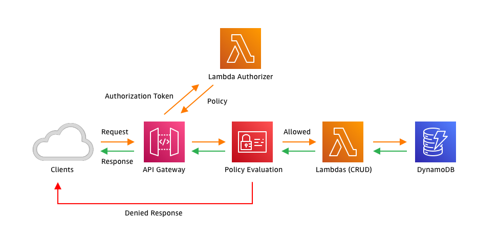
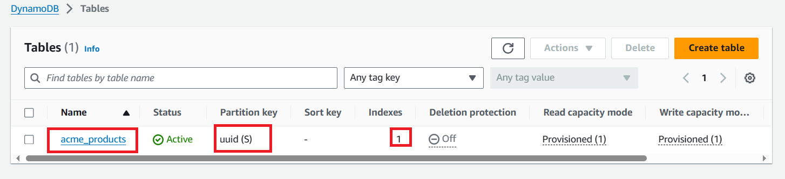
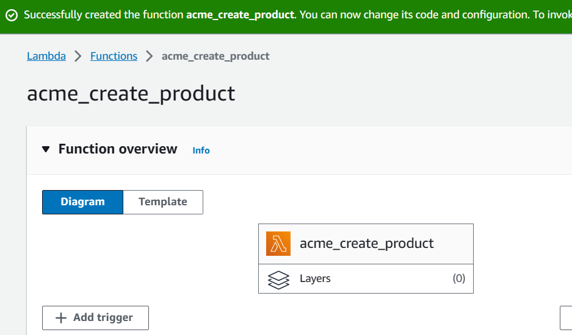
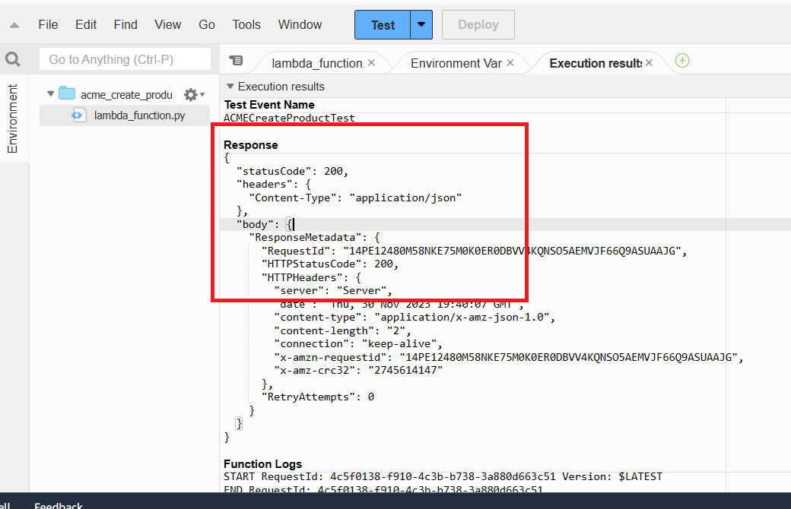
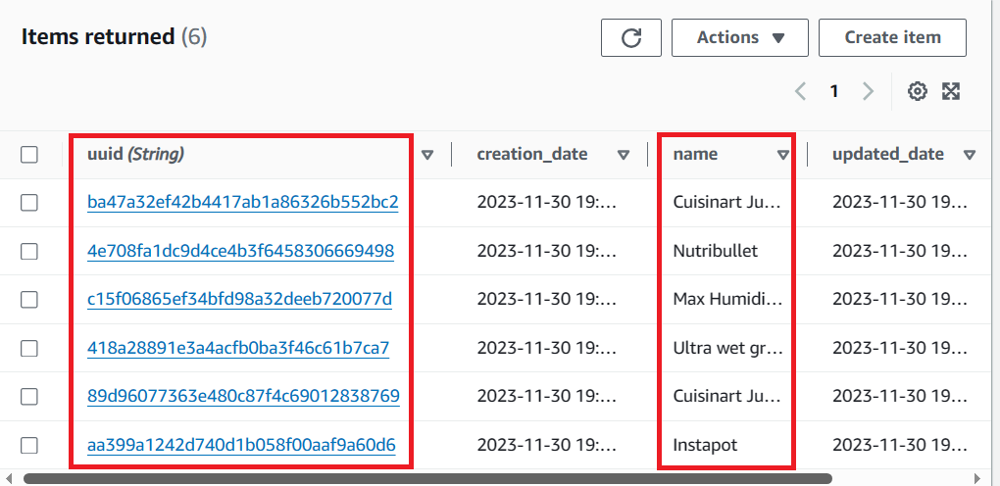
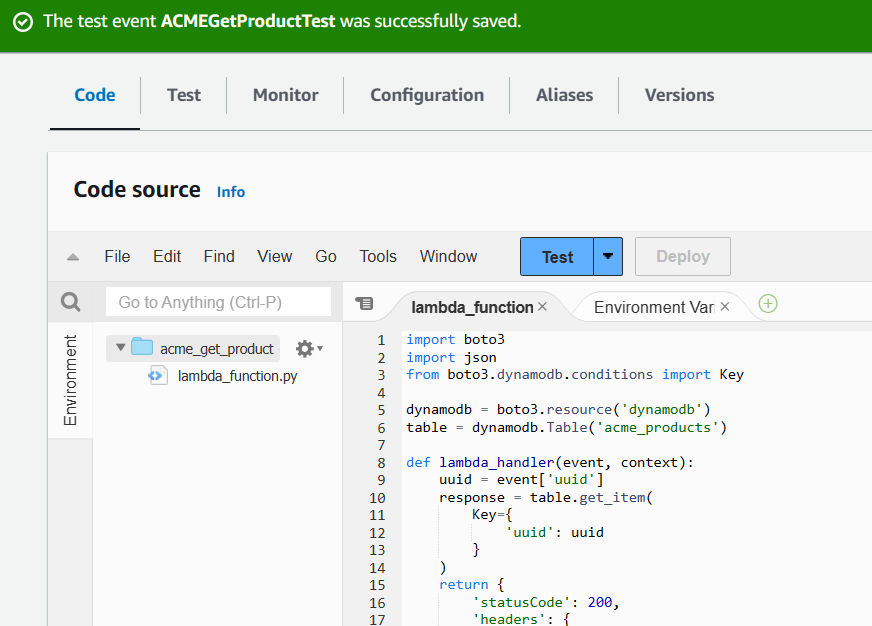
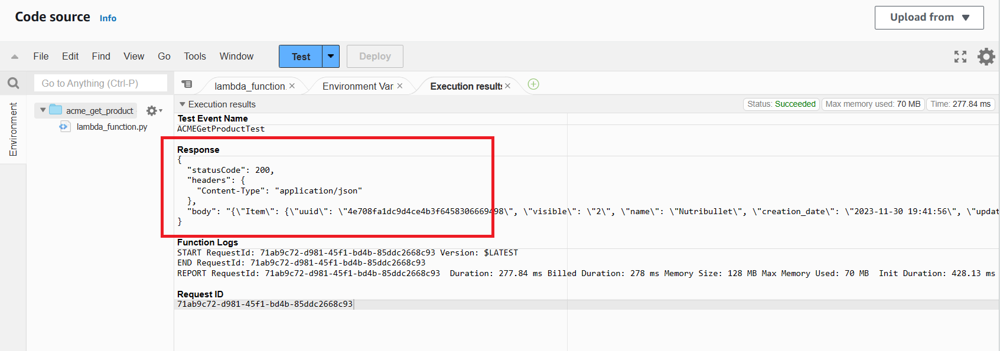

# Building a Product Catalog web API using Serverless at AWS
## Overview
you’ll explore a real-world scenario as an experienced engineer hired to help build a scalable, resilient, and fault-tolerant web API that provides data to an ecosystem of microservices. According to the specifications, the web API allows requests only from authorized sources, is responsible for delivering information about all products in the company’s catalog, and allows other services to keep the product catalog updated.

With all this information in mind, you’ve decided to rely on an AWS serverless architecture based on Amazon API Gateway, AWS Lambda and Amazon DynamoDB whereas the products catalog will reside on DynamoDB.
## Solution Architecture

### Step 1 create a table in Amazon DynamoDB that will serve as your products catalog database
At the top of the AWS Management Console, in the search bar, search for and choose DynamoDB. On the left navigation menu, choose Tables.
* Choose Create table.
* As your Table name, enter acme_products
* As your Partition key, enter uuid and keep it as a String.
* Leave Sort key field empty.
* Choose  Customize settings
* This will expand more configurations options.
Scroll down to Secondary indexes section and choose Create global index .
From the New global secondary index window, configure the following options:
* Partition key: visible
* Data type: String 
* Sort key: Leave blank
* Index name: 
* visible-index
* Attribute projections:  All
* Choose Create index.
You are taken back to the Create table page. Leave all remaining options with their default values.
Scroll down and choose Create table.



> Note: It takes a few seconds to provision the table. As soon as it finishes, the table is ready to be used.
> You can select your acme_products table and browse through the navigation tabs to view available configuration options for the table.

🎉Congratulations! You have successfully created a table in Amazon DynamoDB that will serve as your products catalog database.
## AWS Lambda
### CREATE PRODUCT LAMBDA FUNCTION CREATION
* At the top of the DynamoDB Management Console, in the search bar, search for and choose Lambda
* In the left menu, choose Functions.
* Choose Create function .
* Choose  Author from scratch .
* Configure the following options from the Basic information section.
* Function name: acme_create_product
* Runtime: Python 3.9 
* Archictecture:  x86_64
Permissions:
* Expand  Change default execution role.
* Execution role:  Use an existing role
* Existing role: ACMEAPILambdaExecutionRole 
> Note: This role grants this Lambda function and other permissions needed to interact with DynamoDB.
* Choose Create function

Scroll down to the Code source section. Copy and paste the code below, replacing the existing code in the lambda_function.py file.
acme_create_product.py
* Choose Deploy
Test the function.
* Choose Test
The Configure test event dialog window opens.
* Configure the following options.
  + Event name: ACMECreateProductTest
  + Event sharing settings:  Private
  + Template - optional: hello-world
  + Event JSON: Copy and paste the code below.
  ```
  {
    "name": "Some Cool Product Name",
    "visible": "1"
  }
  ```
  * Choose Save to finish the test setup.
    Image
  * Choose Test
  It will open a second tab named Execution results and, if the test runs without errors, you will see a Response with a statusCode equals to 200.


Take advantage of the test feature and create more products. This will facilitate your tests in the future.

* At the top of the DynamoDB Management Console, in the search bar, search for and choose DynamoDB.
* Choose Tables from the menu on the left.
* Choose the acme_products text link to open the table details.
* Choose Explore table items.
You see items there that were written by your function.


### Step 2.2 2.2: GET PRODUCT LAMBDA FUNCTION CREATION
Return to your Lambda functions main screen.
* Choose Create function .
* Choose  Author from scratch .
* Configure the following options from the Basic information section.
* Function name: acme_get_product
* Runtime: Python 3.9 
* Archictecture:  x86_64
Permissions:
* Expand  Change default execution role.
* Execution role:  Use an existing role
* Existing role: ACMEAPILambdaExecutionRole 
* Choose Create function
  
* Scroll down to the Code source section.
* Copy and paste the code below, replacing the existing code in the lambda_function.py file.
```
Week8/Code/acme_get_product.py
```
* After pasting the code, choose Deploy
* Choose Test 
The Configure test event dialog window opens.
Configure the following options.
 + Test event action:  Create new event
 + Event name: ACMEGetProductTest
 + Event sharing settings:  Private
 + Template - optional: hello-world
 + Event JSON: Copy and paste the code below.
```
{
    "uuid": "replace_with_a_valid_uuid"
}
```
* Scroll down and choose Save to finish the test setup.
 
  
 * Choose Test
It will open a second tab called Execution results and, if the test runs without errors, you will see a Response with an HTTPStatusCode equals to 200 and an Item key with the data related to the product uuid you passed.

 

