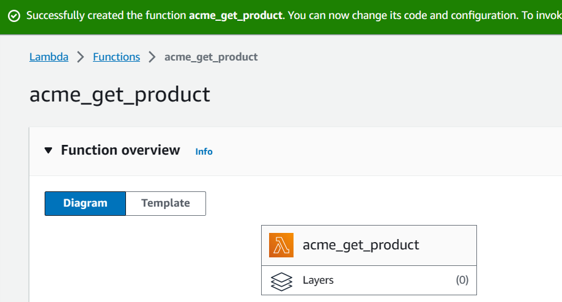

# Building a Product Catalog web API using Serverless at AWS
## Overview
you’ll explore a real-world scenario as an experienced engineer hired to help build a scalable, resilient, and fault-tolerant web API that provides data to an ecosystem of microservices. According to the specifications, the web API allows requests only from authorized sources, is responsible for delivering information about all products in the company’s catalog, and allows other services to keep the product catalog updated.

With all this information in mind, you’ve decided to rely on an AWS serverless architecture based on Amazon API Gateway, AWS Lambda and Amazon DynamoDB whereas the products catalog will reside on DynamoDB.
## Solution Architecture

## Step 1 DynamoDB
### Step 1.1 create a table in Amazon DynamoDB that will serve as your products catalog database
At the top of the AWS Management Console, in the search bar, search for and choose DynamoDB. On the left navigation menu, choose Tables.
* Choose Create table.
* As your Table name, enter acme_products
* As your Partition key, enter uuid and keep it as a String.
* Leave Sort key field empty.
* Choose  Customize settings
* This will expand more configurations options.
Scroll down to Secondary indexes section and choose Create global index .
From the New global secondary index window, configure the following options:
* Partition key: visible
* Data type: String 
* Sort key: Leave blank
* Index name: 
* visible-index
* Attribute projections:  All
* Choose Create index.
You are taken back to the Create table page. Leave all remaining options with their default values.
Scroll down and choose Create table.


> Note: It takes a few seconds to provision the table. As soon as it finishes, the table is ready to be used.
> You can select your acme_products table and browse through the navigation tabs to view available configuration options for the table.

🎉Congratulations! You have successfully created a table in Amazon DynamoDB that will serve as your products catalog database.
## Step 2 AWS Lambda
### Step 2.1 CREATE PRODUCT LAMBDA FUNCTION CREATION
* At the top of the DynamoDB Management Console, in the search bar, search for and choose Lambda
* In the left menu, choose Functions.
* Choose Create function .
* Choose  Author from scratch .
* Configure the following options from the Basic information section.
* Function name: acme_create_product
* Runtime: Python 3.9 
* Archictecture:  x86_64
Permissions:
* Expand  Change default execution role.
* Execution role:  Use an existing role
* Existing role: ACMEAPILambdaExecutionRole 
> Note: This role grants this Lambda function and other permissions needed to interact with DynamoDB.
* Choose Create function

Scroll down to the Code source section. Copy and paste the code below, replacing the existing code in the lambda_function.py file.
acme_create_product.py
* Choose Deploy
Test the function.
* Choose Test
The Configure test event dialog window opens.
* Configure the following options.
  + Event name: ACMECreateProductTest
  + Event sharing settings:  Private
  + Template - optional: hello-world
  + Event JSON: Copy and paste the code below.
  ```
  {
    "name": "Some Cool Product Name",
    "visible": "1"
  }
  ```
  * Choose Save to finish the test setup.
    Image
  * Choose Test
  It will open a second tab named Execution results and, if the test runs without errors, you will see a Response with a statusCode equals to 200.


Take advantage of the test feature and create more products. This will facilitate your tests in the future.

* At the top of the DynamoDB Management Console, in the search bar, search for and choose DynamoDB.
* Choose Tables from the menu on the left.
* Choose the acme_products text link to open the table details.
* Choose Explore table items.
You see items there that were written by your function.


### Step 2.2 GET PRODUCT LAMBDA FUNCTION CREATION
Return to your Lambda functions main screen.
* Choose Create function .
* Choose  Author from scratch .
* Configure the following options from the Basic information section.
* Function name: acme_get_product
* Runtime: Python 3.9 
* Archictecture:  x86_64
Permissions:
* Expand  Change default execution role.
* Execution role:  Use an existing role
* Existing role: ACMEAPILambdaExecutionRole 
* Choose Create function
  
* Scroll down to the Code source section.
* Copy and paste the code below, replacing the existing code in the lambda_function.py file.
```
Week8/Code/acme_get_product.py
```
* After pasting the code, choose Deploy
* Choose Test 
The Configure test event dialog window opens.
Configure the following options.
 + Test event action:  Create new event
 + Event name: ACMEGetProductTest
 + Event sharing settings:  Private
 + Template - optional: hello-world
 + Event JSON: Copy and paste the code below.
```
{
    "uuid": "replace_with_a_valid_uuid"
}
```
* Scroll down and choose Save to finish the test setup.
 
  
 * Choose Test
It will open a second tab called Execution results and, if the test runs without errors, you will see a Response with an HTTPStatusCode equals to 200 and an Item key with the data related to the product uuid you passed.

 

### Step 2.3 UPDATE PRODUCT LAMBDA FUNCTION CREATION
* Return to your Lambda functions main screen.
* Choose Create function 
* Choose  Author from scratch .
* Configure the following options from the Basic information section.
* Function name: acme_update_product
* Runtime: Python 3.9 
* Archictecture:  x86_64
Permissions:
* Expand  Change default execution role.
* Execution role:  Use an existing role
* Existing role: ACMEAPILambdaExecutionRole 
* Choose Create function


* Scroll down to the Code source section.
* Copy and paste the code below, replacing the existing code in the lambda_function.py file.
  
  
* After pasting the code choose Deploy
his function is going to be used to update one product by its uuid.
* Choose Test
The Configure test event dialog window opens.
* Configure the following options.
* Test event action:  Create new event
* Event name: ACMEUpdateProductTest
* Event sharing settings:  Private
* Template - optional: hello-world
* Event JSON: Copy and paste the code below.
  ```
  {
    "uuid": "replace_with_a_valid_uuid",
    "visible": "1",
    "name": "Some UPDATED Product Name"
  }
  ```
  > Caution: You have to get a valid uuid in your DynamoDB table items to test.
  
Scroll down and choose Save to finish the test setup.
* Choose Test  
It will open a second tab called Execution results and, if the test runs without errors, you will see a Response with an HTTPStatusCode equals to 200 and the Attributes key with the updated data related to the product uuid you passed.


>  Note: If you want to double-check the updated data, you can go back to DynamoDB and browse items there.

### Step 2.4 DELETE PRODUCT LAMBDA FUNCTION CREATION
* Back to your Lambda functions main screen.
* Choose Create function .
* Choose  Author from scratch .
Configure the following options from the Basic information section.
* Function name: acme_delete_product
* Runtime: Python 3.9 
* Architecture:  x86_64
Permissions:
* Expand  Change default execution role.
* Execution role:  Use an existing role
* Existing role: ACMEAPILambdaExecutionRole 
* Choose Create function

  


* Scroll down to the Code source section.
* Copy and paste the code below, replacing the existing code in the lambda_function.py file.

* After pasting the code, choose Deploy
This function is going to be used to delete a product by its uuid.
* Choose Test 
The Configure test event dialog window opens.
Configure the following options.
* Test event action:  Create new event
* Event name: ACMEDeleteProductTest
* Event sharing settings:  Private
* Template - optional: hello-world
* Event JSON: Copy and paste the code below.
```
{
    "uuid": "replace_with_a_valid_uuid"
}
```
 > Caution: You have to get a valid uuid in your DynamoDB table items to test.
* Scroll down and choose Save to finish the test setup.
* Choose Test  
It will open a second tab called Execution results and, if the test runs without errors, you see a Response with an HTTPStatusCode equal to 200.
The data related to the uuid you passed was deleted from DynamoDB.


### Step 2.5 LIST PRODUCTS LAMBDA FUNCTION CREATION
* Back to your Lambda functions main screen.
* Choose Create function .
* Choose  Author from scratch .
* Configure the following options from the Basic information section.
* Function name: acme_list_products
* Runtime: Python 3.9 
* Architecture:  x86_64
Permissions:
* Expand  Change default execution role.
* Execution role:  Use an existing role
* Existing role: ACMEAPILambdaExecutionRole 
* Choose Create function
  
  
  
* Scroll down to the Code source section.
* Copy and paste the code below, replacing the existing code in the lambda_function.py file.
  
* Choose the Deploy
This function is going to be used to retrieve all visible products from our DynamoDB table. You can test it creating a test just like you did before. It is not necessary to send any payload as this function doesn’t need any extra information.
* Choose Test
The Configure test event dialog window opens.
Configure the following options.
* Test event action:  Create new event
* Event name: ACMEListProductsTest
* Event sharing settings:  Private
* Template - optional: hello-world
* Event JSON: Copy and paste the code below.
```
{}
```
It is an empty JSON as this function doesn’t need to receive any extra information.

* Scroll down and choose Save to finish the test setup.
* Choose Test
  
It will open a second tab called Execution results and, if the test runs flawlessly, you will see a Response with a HTTPStatusCode equals to 200.
You will also see in this response an array of Items that corresponds to all items you have inside your DynamoDB table.


  
Test ok!

From this moment on, you have 5 working Lambda functions as follows:
+ acme_create_product
+ acme_get_product
+ acme_update_product
+ acme_delete_product
+ acme_list_products
  
🎉Congratulations! You have successfully created the required Lambda functions.
## Step 3 API Gateway
### Step 3.1 CREATE API GATEWAY
* At the top of the AWS Management Console, in the search bar, search for and choose API Gateway in a new browser tab.
* Choose APIs in your left navigation menu.
* In Choose an API type step, choose Build inside the REST API (NOT Private) box.
* Your API setup:
* Create new API:  New API.
* API name: ACME Products API
* Description: Products API that connects a web endpoint to several Lambda functions
* Regional 
* Choose Create API
  
Your Amazon API Gateway is ready to be configured.
### Step 3.2 CREATE API GATEWAY RESOURCE
In this task you will create the products resource for your API Gateway.
* Click Create Resource option.
* Now in the Create Resource screen, enter the following values:
* Resource Name: products
* CORS (Cross Origin Resource Sharing): Leave checkbox de-selected.
* Choose Create resource

Your next step is to create the methods and link them with your functions.
### Step 3.3 CREATE API GATEWAY GET METHOD
* Keep your /products resource selected.
* Click on Create method.
* Select method type as GET  .
Configure the method:
* Integration type:  Lambda Function
* Lambda proxy integration:  Note: Leave toggle button de-selected.
* Lambda Function: acme_list_products (as soon as you type, it will open a selector dialog for you to select the function that already exists)
* Default Timeout: Leave toggle button selected.
* Choose Create method


You just created your first method. You are going to repeat this for other verbs like POST, PUT and DELETE as well.
Before proceeding, you can test your method.
* Go to Test tab and click on  Test at the bottom.
If your test succeeded, you will see the response from the Lambda Function which includes a list of products from your catalog.
Your expected Response Body output should look similar to the following:

### Step 3.4 CREATE API GATEWAY POST METHOD
* Keep your /products resource selected.
* Click on Create method.
* Select method type as POST  .
Now you need to configure the method.
* Integration type:  Lambda Function
* Lambda proxy integration:  Note: Leave toggle button de-selected.
* Lambda Function: acme_create_product (as soon as you type, it will open a selector dialog for you to select the function that already exists)
* Default Timeout: Leave toggle button selected.
* Choose Create method

  
  
Before proceeding, test your method.
* Go to Test tab and click on  Test at the bottom.
Scroll down to Request Body field and enter the following payload.
```
{
    "visible": "1",
    "name": "Some Product Name"
}
```
* Choose Test at the bottom.
If your test succeeds, you will see the response from the Lambda Function which includes a statusCode 200.
The API Gateway passed the Request Body to your Lambda Function which got the payload and wrote to the DynamoDB table. You can go back to your table and check the new item there!
Your expected Response Body output should look similar to the following:
```
{"statusCode": 200, "headers": {"Content-Type": "application/json"}, "body": {"ResponseMetadata": {"RequestId": "DTCSO906O5GNKFSCHPUFED2LTRVV4KQNSO5AEMVJF66Q9ASUAAJG", "HTTPStatusCode": 200, "HTTPHeaders": {"server": "Server", "date": "Mon, 24 Oct 2022 17:28:57 GMT", "content-type": "application/x-amz-json-1.0", "content-length": "2", "connection": "keep-alive", "x-amzn-requestid": "DTCSO906O5GNKFSCHPUFED2LTRVV4KQNSO5AEMVJF66Q9ASUAAJG", "x-amz-crc32": "2745614147"}, "RetryAttempts": 0}}}
```
### Step 3.5 CREATE API GATEWAY PUT METHOD
* Keep your /products resource selected.
* Click on Create method.
* Select method type as PUT  .
Now you need to configure the method.
* Integration type:  Lambda Function
* Lambda proxy integration:  Note: Leave toggle button de-selected.
* Lambda Function: acme_update_product (as soon as you type, it will open a selector dialog for you to select the function that already exists)
* Default Timeout: Leave toggle button selected.
* Choose Create method
  
Test your PUT method.
* Go to Test tab and click on  Test at the bottom.
Scroll down to Request Body field and enter the following payload.
> Note: Make sure to replace uuid with the one you copied from Dynamodb.
```
{
    "uuid": "replace_with_a_valid_uuid",
    "visible": "1",
    "name": "Some UPDATED Product Name"
}
```
* Choose  Test at the bottom.
If your test succeeded, you will see the response from the Lambda Function which includes a statusCode 200 and the Attributes updated. Check that inside your Lambda has a logic to keep dates updated as well.
The API Gateway passed the Request Body to your Lambda Function which got the payload and updated the DynamoDB table item related to the uuid you passed. You can go back to your table and check the updated item.
Your expected Response Body output should look similar to the following:
```
{"statusCode": 200, "headers": {"Content-Type": "application/json"}, "body": {"Attributes": {"visible": "1", "name": "Some UPDATED Product Name", "updated_date": "2022-10-24 17:49:52"}, "ResponseMetadata": {"RequestId": "1KUDMV5RE9M7467O509PF1HIKRVV4KQNSO5AEMVJF66Q9ASUAAJG", "HTTPStatusCode": 200, "HTTPHeaders": {"server": "Server", "date": "Mon, 24 Oct 2022 17:49:52 GMT", "content-type": "application/x-amz-json-1.0", "content-length": "120", "connection": "keep-alive", "x-amzn-requestid": "1KUDMV5RE9M7467O509PF1HIKRVV4KQNSO5AEMVJF66Q9ASUAAJG", "x-amz-crc32": "2058753312"}, "RetryAttempts": 0}}}
```
### Step 3.6 CREATE API GATEWAY DELETE METHOD
* Keep your /products resource selected.
* Click on Create method.
* Select method type as DELETE 
Now you need to configure the method.
* Integration type:  Lambda Function
* Lambda proxy integration:  Note: Leave toggle button de-selected.
* Lambda Function: acme_delete_product (as soon as you type, it will open a selector dialog for you to select the function that already exists)
* Default Timeout: Leave toggle button selected.
* Choose Create method
  
* Go to Test tab and click on  Test at the bottom.
* Scroll down to Request Body field and enter the following payload.
> Note: Make sure to replace uuid with the one you copied from Dynamodb.
```
{
    "uuid": "replace_with_a_valid_uuid"
}
```
* Choose  Test at the bottom.
If your test succeeded, you will see the response from the Lambda Function which includes a statusCode 200.
You can go back to your DynamoDB table to check if the product was deleted indeed.
Your expected Response Body output should look similar to the following:
```
{"statusCode": 200, "headers": {"Content-Type": "application/json"}, "body": {"ResponseMetadata": {"RequestId": "NGJ9VAMKPNRFKI461KEOMVQ87VVV4KQNSO5AEMVJF66Q9ASUAAJG", "HTTPStatusCode": 200, "HTTPHeaders": {"server": "Server", "date": "Mon, 24 Oct 2022 17:56:13 GMT", "content-type": "application/x-amz-json-1.0", "content-length": "2", "connection": "keep-alive", "x-amzn-requestid": "NGJ9VAMKPNRFKI461KEOMVQ87VVV4KQNSO5AEMVJF66Q9ASUAAJG", "x-amz-crc32": "2745614147"}, "RetryAttempts": 0}}}
```
### Step 3.7 AMAZON API GATEWAY GET METHOD, PRODUCT RETRIEVAL
```
/products/<uuid>
```
Where uuid will be the unique ID that will correspond to a specific product in your database. In this task you will create the /products resource.

* Keep your /products resource selected.
* Click on Create resource.
* Proxy resource: Note: Leave button de-selected.
* Resource Name: {uuid}
* CORS (Cross Origin Resource Sharing):  Note: Leave checkbox de-selected.
* Choose Create resource
This will create a new resource that will allow you to make requests to ** /products/*. 
This is the way you create a resource that can have different values. Any value passed after /products/ will be mapped to uuid variable.
With your new resource created, create the GET HTTP method and associate the Lambda function you created before.
* Keep your /{uuid} resource selected.
* Click on Create method.
* Select method type as GET  .
Now you need to configure the GET method.
* Integration type:  Lambda Function
* Lambda proxy integration:  Note: Leave toggle button de-selected.
* Lambda Function: acme_get_product (as soon as you type, it will open a selector dialog for you to select the function that already exists)
* Default Timeout: 
> Note: De-select this button from its default selected state. When de-selected a new entry box titled Custom Timeout will appear, give it as
> 50
* Choose Create method


Now you need to guarantee the uuid sent within your path is also sent to your lambda. In order to accomplish this, you have to change your Integration Request.
* Choose the Integration Request tab.
* Scroll down and expand Expand  Mapping Templates.
* Click on Create template.
* In the Content-Type text field that opened, enter ** application/json
* Scroll down a little bit. Leave the Generate template selector field empty and enter the following in the template area:
```
{
    "uuid": "$input.params('uuid')"
}
```
* Choose Create template
* Scroll up and choose the Method Execution link to go back to the main screen.
* Click on Test tab.
* At the top of the AWS Management Console, in the search bar, search for and choose DynamoDB
* In the navigation pane choose Tables, select the acme_products table. Choose Explore table items .
* Under the uuid column copy any of the existing values to be used in the next step.
* Switch back to the API Gateway console tab.
* Fill the field {uuid} just under Path with a valid uuid you just copied.
* Choose  Test.
> Note: If you have no items in the table due to testing the API requests then open the acme_create_product lambda function and click the test button to generate a new item in the table. You can then test this API request with the UUID of the new item in the table.

If your test succeeded, you will see the response from the Lambda Function which shows the information related to the product.
Your expected Response Body output should look similar to the following:
```
{"statusCode": 200, "headers": {"Content-Type": "application/json"}, "body": "{\"Item\": {\"uuid\": \"f4ce4eb9ba6445078c0cd03bdc3feb64\", \"visible\": \"1\", \"name\": \"Some Product Name\", \"creation_date\": \"2022-10-24 17:28:56\", \"updated_date\": \"2022-10-24 17:28:56\"}, \"ResponseMetadata\": {\"RequestId\": \"IGUUUPBB1HNPFFC76IM7S419FVVV4KQNSO5AEMVJF66Q9ASUAAJG\", \"HTTPStatusCode\": 200, \"HTTPHeaders\": {\"server\": \"Server\", \"date\": \"Mon, 24 Oct 2022 18:18:47 GMT\", \"content-type\": \"application/x-amz-json-1.0\", \"content-length\": \"198\", \"connection\": \"keep-alive\", \"x-amzn-requestid\": \"IGUUUPBB1HNPFFC76IM7S419FVVV4KQNSO5AEMVJF66Q9ASUAAJG\", \"x-amz-crc32\": \"3508550731\"}, \"RetryAttempts\": 0}}"}
```
Now you have a functional API Gateway. There is a problem though. In this setup, the API is open to the world. This means anyone can use it as soon as you deploy.
In your next task, you are going to add a protection layer to your API.
## Step 4 AWS Lambda authorizer


